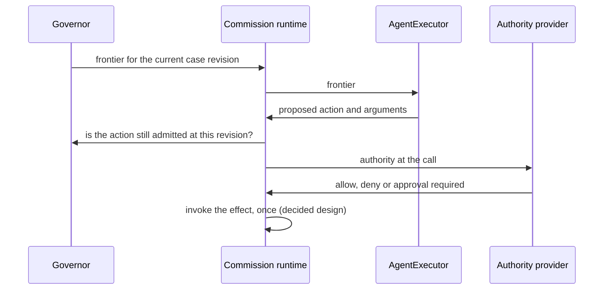

:::caution[The loop executes no effect yet]

The local runtime loop, `run_until_blocked`, runs steps 1 to 4 in this order today. It records
each action request with its revalidation outcome and executes none of them.
Step 5 is **decided design, not shipped code**. See [Status](../status.md).

:::

| Step | What happens | State |
|---|---|---|
| 1. Governor issues a frontier | For the current case revision: claims, open obligations, and the status of each action. | The `Governor` port exists |
| 2. Executor proposes | It picks an action the frontier lists and supplies arguments. Nothing else it says is trusted. | The `AgentExecutor` port exists |
| 3. Commission rechecks | Is the action still admitted, at this case revision, by the current frontier? | Action-request revalidation exists: stale revision, frontier admission, approval required |
| 4. Authority at the call | An authority provider answers allow, deny or approval required. A deny or a provider failure stops the action. | The `AuthorityProvider` port and its check exist |
| 5. The runtime invokes the effect | Only after those checks pass, and only once. The executor proposes; it does not invoke. | Decided design |

## Effect invocation: decided design, not shipped code

Atlas ADR 0082, decided on 2026-10-04: the Commission runtime invokes an action's effect after
rechecking frontier, case revision and authority. Executors (Loom, a human tool, a workflow
executor, a test fake) only return a proposed action, and never see the binding or the result of
the invocation. An action with no binding is refused by name, and a refusal at any step invokes
nothing.

The work is planned. Some of its questions are still open, and none of it is in the crates yet.
